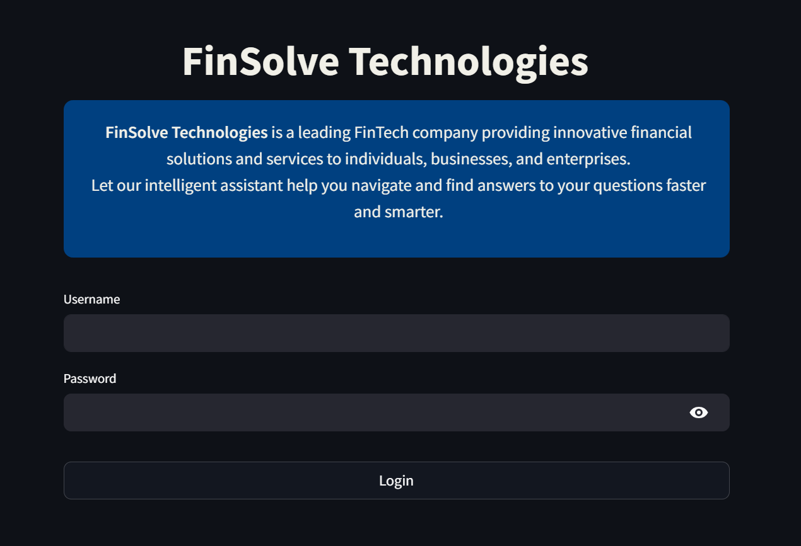
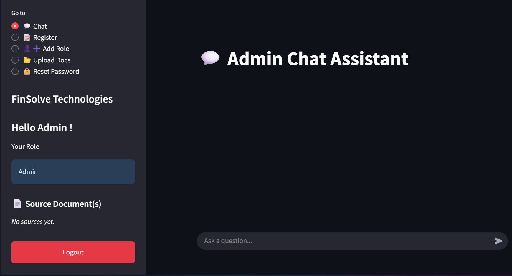
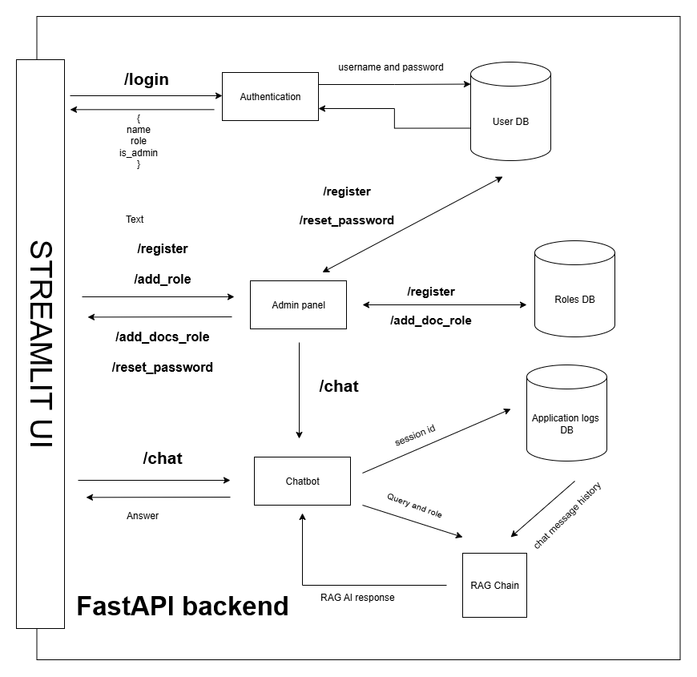
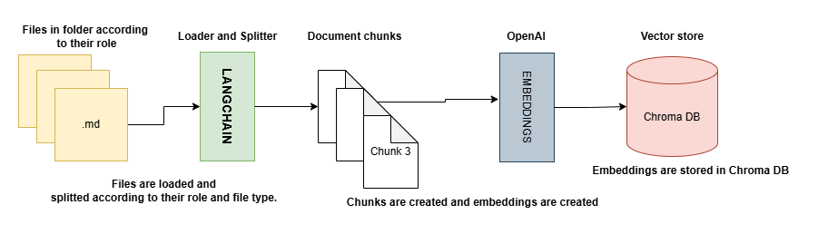
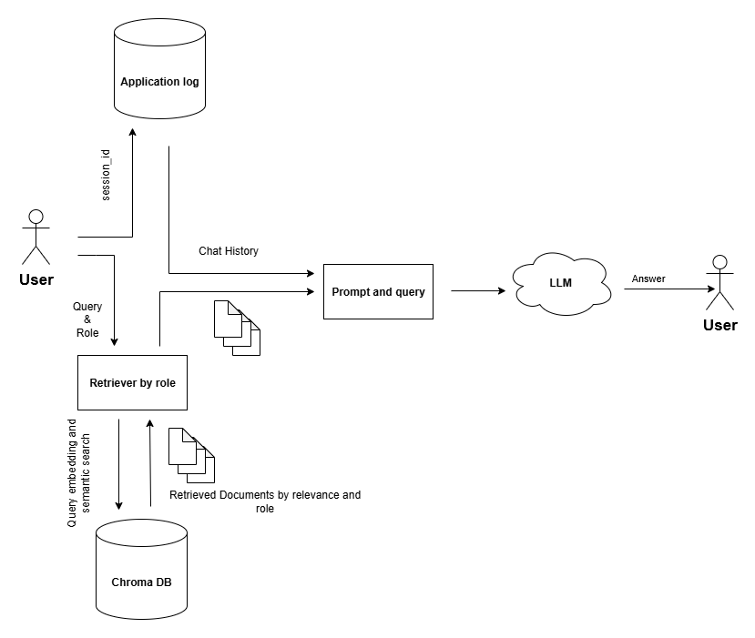
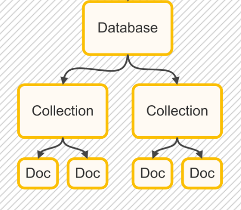

# Codebasics RBAC + RAG Chatbot

A secure, role-based access control (RBAC) chatbot system using Retrieval-Augmented Generation (RAG) for personalized responses, built with **FastAPI** and **Streamlit**. This project enables department-specific document search and chat functionality with robust authentication and authorization.

## Features

- **User Authentication**: Login and password management.



- **Role-Based Access Control**:
  - Admins can chat, add users, roles, upload documents and reset password for users.
  - Normal users can only chat and query documents as per their role and access.

- **RAG-Powered Chatbot**:
  - Answers questions using uploaded documents.
  - Role-specific response filtering.
  - Handles follow up question using chat history.

- **Document Upload**: Supports uploading any type of files per role. (.pdf, .md, .csv, .txt)

- **Chat History**: Stores session-wise history. Chatbot handles follow up questions without giving context again and again.

- **Memory management**: On backend startup, a clean-up script runs every 4 hours clearing chat history older than 24 hours leading to better memory management and cost (if ran on cloud).

2025-07-01 19:31:14 INFO [Cleanup] Deleted 11 old messages older than 24 hours.
2025-07-01 23:46:04 INFO [Cleanup] Deleted 4 old messages older than 24 hours.

## Here is a quick look at the Admin panel with all the features.


## Tech Stack

- Python 3.13
- FastAPI (Backend API)
- Streamlit (Frontend UI)
- passlib (Password Hashing)
- LangChain (Document loading and splitting) 
- ChromaDB (Vector Store)
- OpenAI (LLM and Embeddings)
- SQLite (Database)
- Langsmith (Tracing and monitoring)

## Architecture Diagram

#### This architecture shows how the frontend is interacting with the backend. 



## RAG Diagram

#### This diagram shows how files are loaded according to the roles and spliited. Post this they are converted into vector embeddings and stored in Chroma DB. 



## RAG CHAIN 

#### This diagram shows how the RAG chain works.



## Role Based Access Control (RBAC)

#### RBAC is implemented by using the collection feature offered by Chroma DB. The retriever is created based on the role and only those documents which belong to this role are retrieved. Here the collection name is same as the role. (Collection name == User Role).



## Getting Started

### 1. Clone the Repository

```bash
git clone https://github.com/BhavyaJethwa/Codebasics_RBAC_RAG_Chatbot.git
cd Codebasics_RBAC_RAG_Chatbot
```

### 2. Create a Virtual Environment

```bash
python -m venv venv
source venv/bin/activate  # On Windows: venv\Scripts\activate
```

### 3. Install Dependencies

```bash
pip install -r requirements.txt
```

### 4. Run FastAPI Backend

```bash
cd backend
uvicorn main:app --reload
```

### 5. Run Streamlit Frontend

```bash
cd streamlit
streamlit run frontend.py
```

## Default Admin Credentials

```text
Username: Admin
Password: adminpass
```
⚠️ Change the default credentials after first login !

## Data ingestion

**If you want to start from scratch and ingest data** 

```bash
cd backend
python -m RAG.ingestion  
```

## 🗂️ Folder Structure

```
.
├── backend/
│   ├── main.py               # FastAPI backend
│   ├── app.log               # Logging
│   ├── __init__.py
│   ├── chroma_db/            # Vector store (Chroma DB)
│   ├── RAG/                  # RAG logic
│   ├── resources/            # Uploaded documents
│   ├── schemas/              # Pydantic models
│   ├── services/             # Auth, user, role and chatbot services
│   └── utils/                # Utility and database logic
│
├── streamlit/
│   └── frontend.py           # Streamlit frontend
│
├── .env                      # Environment variables
├── .gitignore
├── FinSolve.db               # SQLite database
├── requirements.txt
└── README.md
```

## Roles Supported

- admin
- hr
- finance
- marketing
- engineering
- general or employee
- executive

You can create and assign more roles dynamically via the Admin panel.

## Admin Capabilities

- Chat
- Register new users
- Create new roles
- Upload documents for specific roles
- Reset password for users

## API Endpoints (FastAPI)

- `POST /login` - Authenticate user
- `POST /register` - Register a new user
- `POST /add_role` - Add a new role (Admin only access)
- `POST /add_docs_role` - Upload document as per role
- `POST /chat` - Ask a question with follow up questions handling using chat history (RAG-based)
- `POST /reset_password` - Reset user password
- `GET /get_roles` - Get list of roles


## Contributing

Feel free to fork the project and raise a pull request if you have suggestions or improvements!

